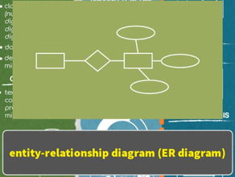
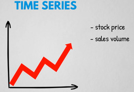
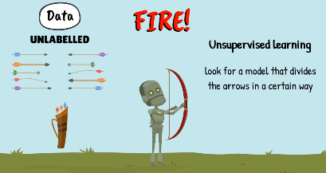

# General Terminologies Of Data Analysis & Analytics 

## Analysis
Refers to past. Explains How? Why?

## Analytics
Referse to future. Explian logical thinking that composed of Qualitaive(intuition + analysis) & Quantative(formulae + algorithms)

## Analysis Vs. Analytics
Analysis(Past) != Analytics(Future)
Data Analysis != Data Analytics
Business Analysis != Business Analytics 

## Quantative Analytics
Working with past data how sales decreased last summer

## Qualitative Analytics
Scenerio is that in boutique when to buy fresh artiles that boost your sales instatnly in specific period of time(e.g in June).

## Business Case Studies:
Examaine events that have already happened.

## Business Analytics:
Not completely rely on data.

## Data Science: 
The decipline relient on data availablity. Most part uses complex mathematical, statistical & programming tools.

It can be used to improve the accuracy of predictions based on data extracted from various activities typical for drilling efficiency.

It uses tools like 
1. Statistical 
2. Mathematical 
3. Programming 
4. Problem-solving
5. data-management

##
 


# General Terminolgies of Data & its Surroundings

## What is Data?
Information stored in a digital format, which can then be used as a base for performing analysis and decision making.


There are two types of data:
1. Traditional data
2. Big Data


### 1. Traditional Data:
1. In form of text, numeric & alphanumeric values in tables.
2. Structured(databases)
3. Can be managed from one computer.

#### Traditional Data: Data Collection
1. Surveys.
2. Automatically sees who is watching specific video at what age. 

#### Traditional Data: Pre-processing of Data
Row data -> data pre-processing -> processing -> information


e.g; 
name of person -> Pakistan(not valid), ali(valid)
age of person -> 932(not valid), 32(valid)


#### Traditional Data: Class Labeling
Numerical: This can be manupulated (e.g; No. of goods sold is 9365 units)
Catagorical: This can't be namupulatable (e.g; Karachi, Pakistan, etc.)


#### Traditional Data: Data Cleansing(Data cleaning/Data scrubbing)

To correct data or dealing with missing values.
e.g; Kolachi -> karachi
e.g; Washington CD -> Washington DC


#### Traditional Data: Case specific:
##### Data Balancing
e.g; Survey of somthing related to gender, only 20% had been sampled while girls had 80%.
Thus, only take 20% of girls to compare with men rest of them will be neglected.
Now, ratio of both gender is 50, 50 equally.


##### Data Shuffling
1. To prevents unwanted patterns
2. Improves predictive performance
3. Helps avoid misleading results.


#### Traditional Data: Visualizations associated with relational database management systems
1. Entity-relationship diagram(ER Diagram)



2. Relational Schema


### 2. Big Data: 
1. Extremely large data.
2. Can be any form 
    a. Structured 
    b. Semi-structured
    c. Unstructured
3. The (3/5/7/11)Vs of big data.
    a. Vision 
    b. value
    c. visualisation
    d. variability
    So on..
4. Distributed between many computers. 
5. Its size terabyte, zetta bytes & even hexabytes.
6. handles images, audio files, mobile data & others.
7. Velocity retrived in real-time


#### Big Data: Techniques
1. Class labeling(e.g; number, text, digital image, digital video data, digital audio data, etc)
2. Data cleansing
3. Dealing with missing values
4. Text data mining: Thw prococess of deriving valuable, unstructured data from text
    Contains blog articles, online platforms, excel files, academic papers -> High volume
5. Data masking: Analyse information without compromising private data.
    * Conceals the original data with random and false data
    * Conduct analysis
    * Keep all confidential information in a secure place
    e.g; Confidentiality preserving data mining

#### Big-Data: Visualizations 
The objects show the complex way in which data is derived from many sources

#### Big-Data: Real-life Example
1. Facebook -> Keeps tarck of video, audio, images & text increased data velocity day by day.


2. Financial trading data -> record stock price every second.


## Fields
### Business Intelligence(BI)
Includes all technology-driven tools involved in the process of analyzing, undertanding & reporting available past data.
BI Report + BI Dashboard -> Make decisions, extract insights & extract ideas
This gives idea sells increased and why.

#### Business Intelligence(BI): Techniques
1. data skills + business & intuitions
2. Explains past performance
    a. What happened?
    b. When did it happen?
    c. How many units did we sell?
    d. In which region did we sell the most goods?
    e. How did our email marketing perform lat quarter in terms of clidk-through rates & revenue generated?
    f. And how does that compare to the performance in the same quarter of last year?
3. By collecting observation -> Quatification of data(The process of representing observations as numbers) -> Measures(The accumulation of observations to show some information) -> KPIs -> Report


    
#### Business Intelligence(BI): Metrics
Aims at gauging business performance or progress. Metrics are very useful for comparisons
```
METRIC =  MEASURE + BUSINESS MEANING

* MEASURE: related to a simple descriptive statistics of past performance 

e.g; 
average quarterly = revenue / customer = somthing metric 
```

#### Business Intelligence(BI): Key Performance Indicators(KPIs)
Can we tracl of all possible metrics we can extract from a data set? Yes
Does it make sense to do that? No
```
KPIs = metrics + business objectives
```


#### Business Intelligence(BI): Application
 


### Traditional Methods(Conventional Data Science)
A set of methods that are drived mainly from statistics asnare adpated for business.
Perfect for forcasting future performance eith great accuracy like regression, cluster, factor, ...

#### Traditional Methods: Application

1. Basic customer data(e.g; numerical vs. catagorical)
    e.g; customer_id: int ->(catagorical) not manupulatable
         no_complains: int -> manupulatable 


2. Historical stick price data
    e.g; col of Date of observations(catagorical)
         col of prices(numerical)

#### Traditional Methods: Techniques
1. Regression for house price against house size.


2. Logestice regression for survey of either this or that.


3. Clustering for catagorical data


4. Factor analysis for many factors(variables)


5. Timeseries analysis for time related things.


#### Traditional Methods: Real-life example
1. UX survey handling of website


2. Forcasting stock price of shares


### Machine Learning
Predict outcomes from data wothout beinfexplicitly programmed to by using Mathematics, signficant amount of computing power & algorithmic techniques.

#### Machine Learning: Techniques
A trail-and-error process. Each consecutive trail is atleast as good as previous one.
There are four ingredients:
1. Data 
2. Model 
3. Objective Function
4. Optimization algorithm


#### Machine Learning: Benefits


#### Machine Learning: Types of ML
There are three types of ML:


1. **Supervised ML**: Training an algo resembles a teacher supervising her students.


2. **Unsupervised ML**:Unsupervised learning is a type of machine learning algorithm used to draw inferences from datasets consisting of input data without labeled responses. 



3. **Reinforcement**:Reinforcement learning (RL) is an area of machine learning concerned with how software agents ought to take actions in an environment in order to maximize the notion of cumulative reward.


#### Machine Learning: Approach & reality
The best approach is to go with unsupervised after training then go with supervised learning.


In reality ML having very tough challange to appraoch real world problem.


#### Machine Learining: Application
To detect fraud


To increase sells


##


