# Probability

## Theoratical(true) Probabilities?
**Definition:** Likelihood of event occuring.
Thus probability is quantifying how likely each event in on it's own
e.g; coin, dice, lottery winning, how much runnning in 6 mins, etc.

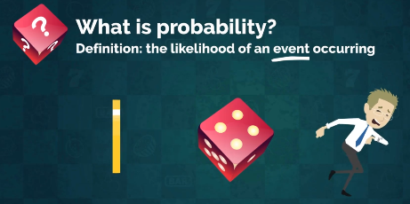

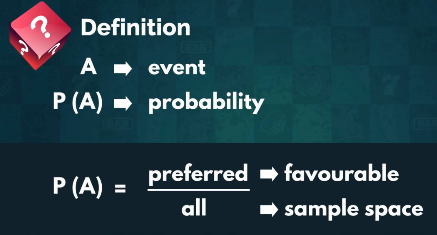

<u>Sample Space:</u> Set of all elements

**Event:** An event is likely or unlikely.

**Formula:** Formula that either you have to draw two things spade or ace.


**Expression:**
The best way to express probability is in float.

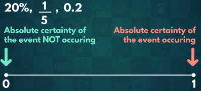

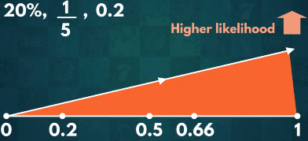


**Examples:** 

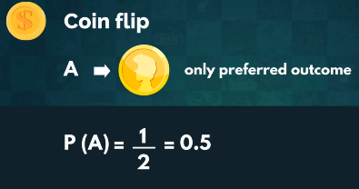

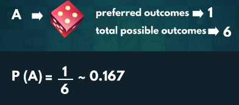

Either you have to draw 3 or 6 means divisible by 3. 

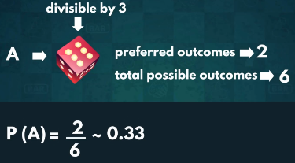

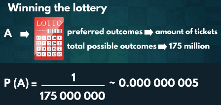

**Comparison:** To compare ```Coin``` is higher probability than ```Lottery```.

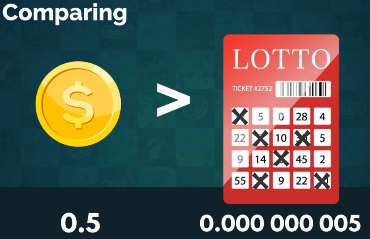

Above image shows that probability of  coin to draw head is higher than winning a lottery.


## Experimental Probabilities
**Definition:** Probabilities we get after conducting experiments.

Exprimental way is more efficient.

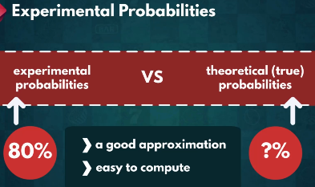

**Formula:**

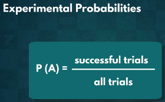

**Trail:** Possible outcome from procesure.

**Experiment:** No. of trails in repitition to chieve average outcome of trials.


## Computing Expected Values
**Definition:** The average outcome we expect if we run an experiment many times.

A = event

E(A) = Expected value of event

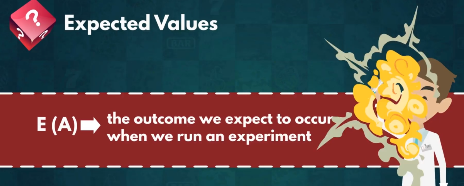

**Scenerio for catagorical outcome:** Drawing spade card from deck and place it again then shuffle it. This process last for 20 times.


This consequence of catagorical outcome.

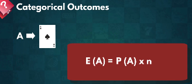

> Total Spade cards in deck = 13
> Total cards in deck = 51
> P(A) = 13 / 51 = 0.25

> Total no. of trails in experiment = n = 20


We expect to get spade 5 times if we ran experiment. However, nothing guarentee 

**Scenerio for numerical outcome:** For all elements of sample space we do summation of product of each element with its probability.

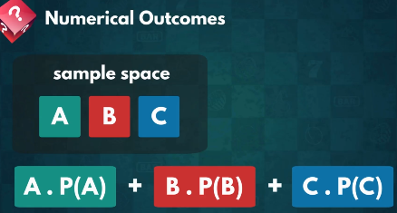


## Probability Frequency Distribution
A probability frequency distribution is a way to show how often an event will happen.

**Scenerio:** Two dices drawn at same time. What is the probability of getting 7.

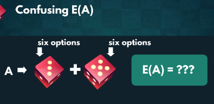

Each die can be drawn 1 to 6 value for 1 trail.

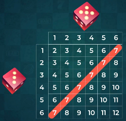

> All the possibilities we have:
> 1 + 6 = 7
> 2 + 5 = 7
> 3 + 4 = 7
> 4 + 3 = 7
> 5 + 2 = 7
> 6 + 1 = 7   

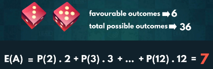

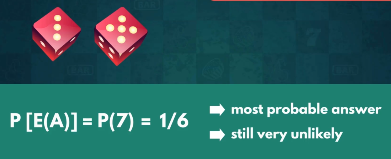

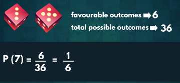

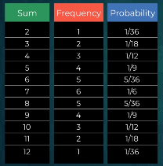

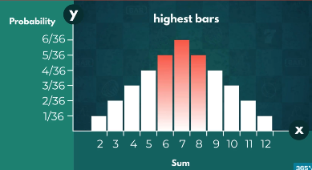


## 

##


