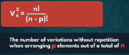
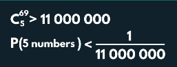

# Combinatorics

## Permutaion & How to use?
**Permutation Definition:**  The number of different possible ways we can arrange a set of elements.

**Scenerio:** Suppose we have 3 ranks gold, silver & brown. we have total 6 way to accomodate them.

 

For other left ranks upto last one.

**Formula:** 
For for basic permutaion is n!

## Factorial
**Definition:** 

**Properties:**

For example:

For example:

If two natural numbers;

## Variation with Repetition
**Definition:** The total no. of ways we can <b>pick and arrange</b> some elements of a given set in repetition.

**Scenerio:** Suppose a person forgot a lock pattern of case in the given images:

Regardless of which one of the 3 letters we decide to start with, we are going to have 3 different options for the second letter.

Thus, total no. of variation is:
    3 x 3 = 9

**Notion & Formula:**

**Applying:**

## Variation without Repetition
The total no. of ways we can <b>pick and arrange</b> some elements of a given set without repetition.

**Scenerio:** 

**Notion & Formula**

## Combinations
**Definintion:** No. of differnet ways we can pick certain elements of a set.

**Scenerio:** In cooporate meeting there is 10 employee and only 3 are going in this meeting. 

Permutations = 6
Variations = 720
Combinations = 120

**Note:** All the different permutations of a single combination ate different variations.

**Formula:** 

## Symmetry of Combinations
The complete symmetry displayed by an isolated object or group of objects is its point group , there being always at least one point common to all the symmetry elements.

**Intuition:**

**Scenerio:** 

## Combinations with Separate Smaple Space
**Definition:** A combination can be a mixture of deffierent smaller individual events.

**Scenerio:** To checkout all items in lunch from restaurant. How many turns it will take to taste all.

**Scenerio:** In online marketing compaign.

**Formula:**

## Combinatorics in Real-Life: The Lottery
**Rules of lottery:** 

**Independent Events:** The likelihood of two independent events occuring simultaneously equals the product of their individual probabilities.

Using formula of combination without repetition.

## Summary

**Types:**

##

